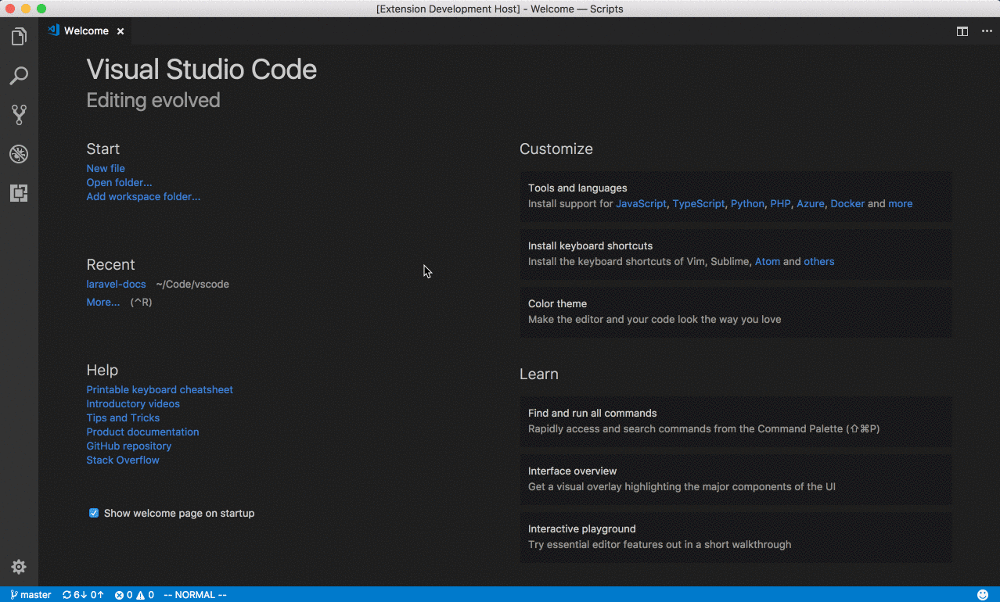

# VSCode Tailwind Docs

Easily access Tailwind docs pages from within VSCode

## Features

To use this extension, simply use `⌘ + Shift + P` to open the command palette (`Ctrl` on windows / linux) and search for "Tailwind Docs" or the specific topic you're after. That's it!

Here's an example:


## Configuration

As of version 2.1.0, the documentation will open in VS Code by default. If you'd like it to open in your system's web browser, uncheck the "Tailwind Docs: Use Simple Browser" setting in your VS Code preferences.

## Development

The files for this extension are generated from the python script `build/build.py`. Run this command to rebuild all extension files:

```
    python3 build.py
```
